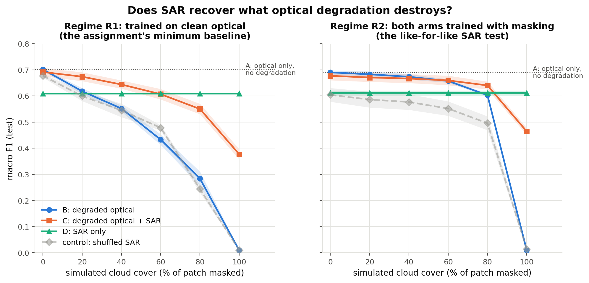
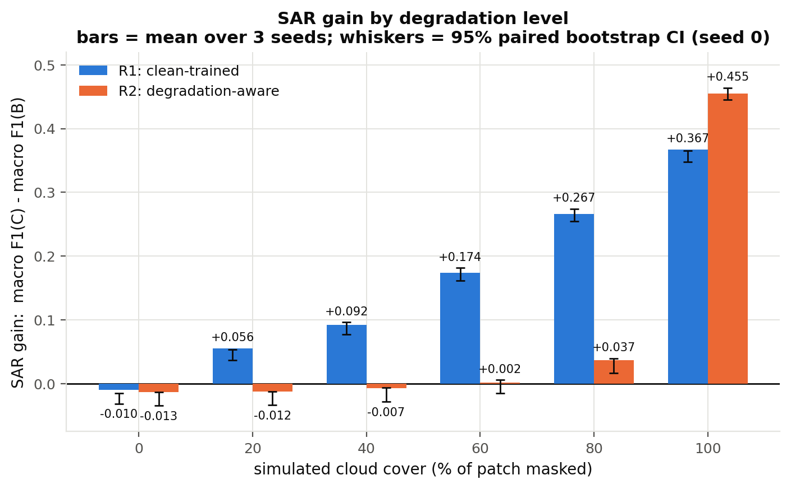
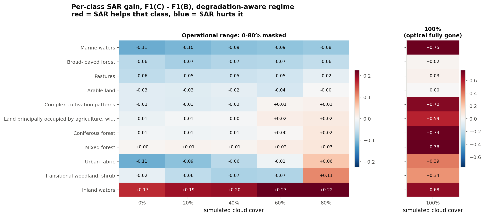
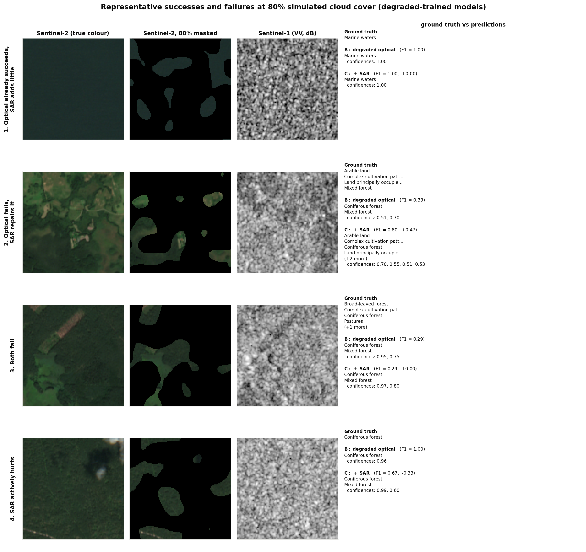
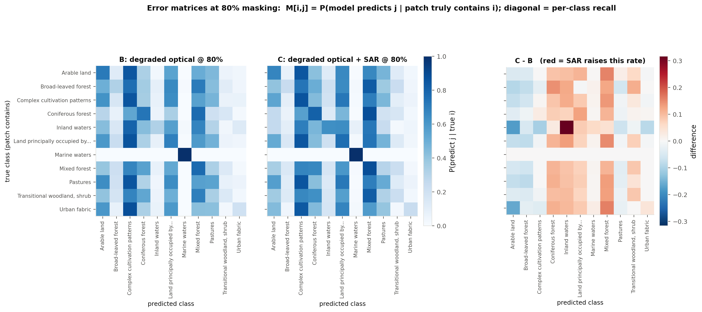
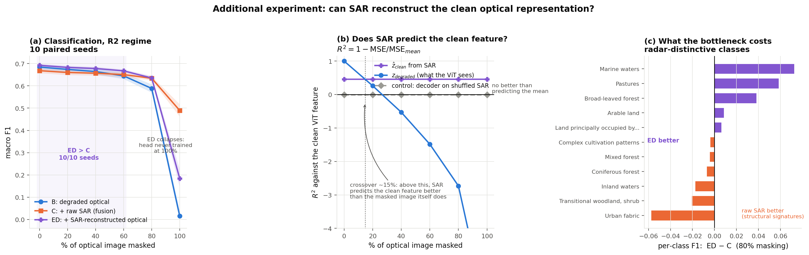

# SAR-Assisted Understanding

**Does Sentinel-1 SAR carry information that recovers what cloud cover destroys in Sentinel-2?**

Short answer: **it depends entirely on what you compare against.** Against an optical
model that has never seen a cloud, SAR looks transformative (+0.27 macro F1 at 80%
cloud). Against an optical model trained with the *same* cloud augmentation, the same
SAR branch buys **+0.037** — because most of the apparent gain was never about SAR at
all. That distinction is the main result of this study.



---

## 1. Problem statement

Optical satellite imagery is interpretable but frequently unusable: clouds obscure a
large fraction of Sentinel-2 acquisitions. Sentinel-1 SAR penetrates cloud and images
in all weather, but measures something physically different — surface roughness,
geometry and dielectric properties rather than reflectance.

The question is whether SAR is a useful *substitute signal* when optical observations
are partially unavailable. Concretely, we classify land cover under three conditions:

| | Condition | Input |
|---|---|---|
| **A** | Optical only | clean Sentinel-2 |
| **B** | Degraded optical | artificially masked Sentinel-2 |
| **C** | Degraded optical + SAR | the *same* masked Sentinel-2 + paired Sentinel-1 |

and compare **B vs C** across masking levels.

## 2. Hypothesis

> SAR provides complementary information that becomes increasingly useful as optical
> observations become unavailable.

This is treated as a hypothesis to be tested, not an assumption. As reported in
§13 it is **partially supported, and much more weakly than the naive comparison
suggests.**

The central methodological risk is that a careless design confirms it for the wrong
reason. If arm C is trained on degraded imagery while arm B is not, C wins — but
because of the training distribution, not because of SAR. The experiment is built
around eliminating that confound.

## 3. Dataset

**BigEarthNet v2.0 (reBEN), Lithuania / summer subset** — 8,775 paired Sentinel-1 /
Sentinel-2 patches, 2.48 GB.

| Property | Value |
|---|---|
| Source | [`hackelle/BigEarthNetV2-Lithuania-Summer-LMDB`](https://huggingface.co/datasets/hackelle/BigEarthNetV2-Lithuania-Summer-LMDB) |
| Provenance | LMDB conversion of the Zenodo originals via [rico-hdl](https://github.com/kai-tub/rico-hdl), the officially recommended tool, by a reBEN co-author (TU Berlin / RSiM) |
| Authoritative original | [Zenodo 10891137](https://zenodo.org/records/10891137) (118 GB) |
| Licence | CDLA-Permissive-1.0 |
| Patch size | 1.2 km × 1.2 km |
| Label type | **multi-label**, CLC-19 nomenclature |
| Tiles / acquisitions | 2 Sentinel-2 tiles (T35ULA, T34UDG), 2 dates (2017-07-20, 2017-08-08) |

### Why this subset

I did not choose a country subset for convenience alone — I measured the alternatives:

| Candidate | Size | Verdict |
|---|---|---|
| Zenodo official reBEN | 118 GB | measured **0.54 MB/s** from Zenodo → ~60 h. Infeasible |
| Full HF LMDB mirror | 155 GB | ~9.5 h at the measured 4.5 MB/s, and it is the entire dataset |
| `GFM-Bench`, `torchgeo`, `lc-col` mirrors | 13–200 GB | split archives; no partial extraction |
| `ranjeetgupta/...14K_S1_and_S2` | 3.1 GB | I listed its central directory over HTTP range requests without downloading it: 13,683 paired patches, but **Serbia-only, 4 tiles**, and an unverified repackaging |
| **Lithuania summer LMDB** | **2.48 GB** | official tooling, documented format, both modalities, official splits ✓ |

A single country is a real limitation (§15). It has one genuine benefit though: it
**removes the country confound**. In full reBEN, single-label "Pastures" patches are
99% Irish and "Agro-forestry" is 100% Portuguese, so a classifier there can score well
by recognising the region rather than the land cover. Within one country that shortcut
is unavailable.

### Single-label vs multi-label — verified, not assumed

BigEarthNet v2.0 is **multi-label**. I checked whether a clean single-label task could
be carved out of it, and it cannot: filtering to patches with exactly one label leaves
**1,476 of 8,775**, of which **89% are "Marine waters"** — degenerate.

So the task is multi-label classification over the **11 classes with ≥1000 positive
patches** (mean 3.5 labels/patch). Rarer classes are dropped; one patch left with no
label was removed, leaving **8,774**.

| Class | Positives | Prevalence |
|---|---:|---:|
| Complex cultivation patterns | 4,449 | 51% |
| Mixed forest | 4,174 | 48% |
| Coniferous forest | 3,862 | 44% |
| Arable land | 3,738 | 43% |
| Land principally occupied by agriculture… | 3,372 | 38% |
| Pastures | 2,981 | 34% |
| Transitional woodland, shrub | 2,588 | 30% |
| Broad-leaved forest | 1,923 | 22% |
| Marine waters | 1,432 | 16% |
| Urban fabric | 1,270 | 15% |
| Inland waters | 1,137 | 13% |

## 4. Data preprocessing and integrity checks

`scripts/01_build_subset.py` audits before modelling and prints everything it finds:

* **Pairing** — S1 and S2 keys come from the same metadata row. 8,774/8,774 unique
  `patch_id` and 8,774/8,774 unique `s1_name`; **0 problems** across a 400-pair deep audit.
* **Shapes/finiteness** — every pair verified as `(12,120,120)` and `(2,120,120)`, no NaN/Inf.
* **Cloud flags** — this metadata release already excludes patches flagged for seasonal
  snow, cloud or shadow. The base optical imagery is therefore clean, so **our artificial
  masking is the only degradation** — important, since real residual cloud would otherwise
  contaminate the "clean" reference.

## 5. Sentinel-2 preprocessing

12 L2A bands, stored at native resolution (120² / 60² / 20² for the 10/20/60 m bands).
Coarse bands are upsampled to 120² by **nearest neighbour** — deliberately, so no band
invents spatial detail it does not have. Then resized to 224² and scaled by `/10000`,
which is the SSL4EO pretraining recipe (`torchgeo._zhu_xlab_transforms`).

**Deviation, deliberate:** torchgeo's published recipe resizes to 256 and centre-crops
to 224, discarding the outer ~12% of the patch. Since this entire study is about *how
much of the patch is visible*, I resize 120→224 directly and keep the whole footprint.

## 6. Sentinel-1 preprocessing

VV/VH σ⁰ in dB, clipped to [−50, 10] dB to guard against layover/shadow spikes, then
standardised channel-wise with the SSL4EO-S12 statistics
`mean = [−12.59, −20.26]`, `std = [5.26, 5.91]`.

That those constants are appropriate is not assumed — the audit measured this subset
and found **VV −12.64 ± 4.22, VH −19.04 ± 5.46 dB**, closely matching the pretraining
statistics. SAR is **never masked**: it is the observation that survives the cloud.

## 7. Cloud / degradation simulation

`src/masking.py`. Levels **0 / 20 / 40 / 60 / 80 %**, plus **100%** as an extra bound.

| Property | Choice |
|---|---|
| Shape | spatially coherent blobs — thresholded low-pass-filtered Gaussian noise (σ = 8 px), *not* per-pixel dropout |
| Coverage | **exact**, by masking the top-`round(level·H·W)` pixels of the field by rank |
| Seed | `sha1(patch_id ‖ level ‖ 1234)` → deterministic per patch and level |
| Fill | per-band dataset mean = **0.0 after normalisation**, the neutral "no observation" encoding |
| Application | mask built at native 120², image resized bilinearly, mask resized **nearest** so cloud edges stay hard |

**Why coherent.** Per-pixel dropout at *p*% leaves nearly every local neighbourhood
partially visible, which is a much easier problem and would understate what SAR buys.
Measured: 91% of masked pixels are fully surrounded by other masked pixels under the
coherent scheme, vs 2.4% under pixel dropout.

**Why this makes B vs C fair.** Because the mask is a pure function of
`(patch_id, level, seed)`, arms B and C receive **byte-identical** degraded imagery.
This is asserted in the smoke test, not merely intended.

## 8. Optical encoder (ViT)

**`torchgeo/vit_small_patch16_224_sentinel2_all_moco`** — ViT-S/16, MoCo-v2
self-supervised on **SSL4EO-S12**. Used **frozen**, as a feature extractor → 384-d.

**A tempting model I deliberately rejected.** The `BIFOLD-BigEarthNetv2-0` organisation
publishes ViTs pretrained *on BigEarthNet v2.0 itself*. They would score substantially
better and be **scientifically invalid here**: our test patches are in their training
set. SSL4EO-S12 is label-free self-supervision on a different corpus, so there is no
label leakage.

**Handling 12 bands vs 13.** SSL4EO pretrained on 13 L1C bands; reBEN is L2A and has no
`B10` (cirrus), leaving 12. Because the pretraining normalisation is a plain `/10000`
with **no mean subtraction**, feeding `B10 = 0` contributes exactly zero to the patch
embedding — so deleting input-channel slice 10 from `patch_embed.proj.weight` is
*mathematically identical* to imputing B10 with its pretraining mean. Not an
approximation, not a random re-init, and not pretending multispectral data is RGB.

*Residual domain shift, documented:* SSL4EO is TOA (L1C), reBEN is BOA (L2A).

## 9. SAR encoder

**`torchgeo/resnet50_sentinel1_all_moco`** — ResNet-50, MoCo on SSL4EO-S12 VV/VH.
Used **frozen** → 2048-d.

**Why pretrained rather than a small CNN: symmetry.** Both branches are then frozen,
both MoCo-pretrained on the *same* corpus, and neither has seen a BigEarthNet label.
Any B→C difference is therefore attributable to the extra **modality**, not to the SAR
branch receiving trainable capacity the optical baseline never gets. A from-scratch SAR
CNN would confound exactly the two explanations the study exists to separate.
(`build_sar_encoder(scratch=True)` provides the small CNN as an alternative.)

## 10. Feature fusion

Late fusion by concatenation, kept deliberately simple:

```
S2 (12,120,120) ─mask─► 224² ─► ViT-S/16 [FROZEN] ─► 384 ─┐
                                                          ├─► concat (2432)
S1 (2,120,120) ────────► 224² ─► ResNet-50 [FROZEN] ─► 2048┘
                                        │
                          LayerNorm ─► Linear(512) ─► ReLU ─► Dropout(0.3) ─► Linear(11)
```

`LayerNorm` on the concatenated vector matters: the 384-d ViT and 2048-d ResNet
features have different scales, and without it the larger-magnitude branch would
dominate the first layer by scale alone.

Arm B is the identical head on the 384-d optical vector only.

## 11. Training procedure

Only the head trains; both encoders stay frozen. This lets us run the encoders **once
per (split, modality, masking level)** and cache the vectors — which is what makes the
whole matrix (4 arms × 2 regimes × 6 levels × 3 seeds) cheap.

AdamW, lr 1e-3, weight decay 1e-4, batch 256, ≤40 epochs, early stopping (patience 8)
on **validation** macro F1. No hyperparameter tuning was performed — these are defaults.
Every arm uses the identical recipe, so arms differ only in their input.

### Two training regimes — and why both are needed

* **R1 "clean-trained"** — trained at 0% masking, evaluated degraded. This is the
  assignment's literal minimum baseline: *"evaluate the same model after masking"*.
* **R2 "degradation-aware"** — both arms trained with masking augmentation (a level
  drawn per sample per epoch from {0, 20, 40, 60, 80}%).

Reporting only R1 would confound "SAR helps" with "training on masked data helps".
Reporting only R2 would ignore what the assignment asked for. So both are reported —
and they disagree, which is the most interesting thing in this study.

### Controls

| Arm | What it isolates |
|---|---|
| **fusion_shuf** | SAR features **permuted across samples**: identical capacity, no genuine pairing. Separates "SAR carries information" from "the head has more parameters". |
| **sar** | SAR-only reference — how far SAR gets on its own. |

## 12. Evaluation methodology

Multi-label, so "accuracy" is stated carefully. Primary metric **macro F1** (as the
assignment names), at a **fixed 0.5 threshold that is never tuned**; **macro mAP** is
reported as the threshold-free companion; Hamming and exact-match accuracy also given.

**Splits.** The official reBEN splits are used, and verified rather than trusted. A
naive check looked alarming — 2 of 2 tiles appear in more than one split — so I plotted
the assignment on the patch grid:

```
TTTTTTTTTTTTTVVVVVVVVVVVVVVVVVVVVVVVVVVVVVVVVVVVVVVTTTTTTTTTTTTT
TTTTTTTTTTTTTVVVVVVVVVVEEEEEEEEEEEEEEEEEEEEEEEEEEEEVVVVVVVVVTTTT
TTTTTTTTTTTTTVVVVVVVVVVEEEEEEEEEEEEEEEEEEEEEEEEEEEEVVVVVVVVVTTTT
TTTTTTTTTTTTTVVVVVVVVVVVVVVVVVVVVVVVVVVVVVVVVVVVVVVVVVVVVVVVTTTT
```

The splits are **concentric contiguous spatial blocks** — test is an interior region
ringed by validation, ringed by train. Only **3.0% of adjacent patch pairs cross a split
boundary**, so spatial autocorrelation between train and test is confined to those
seams. Splits are frozen to `results/metrics/subset_manifest.csv` **before** any
masking, and masking is applied only at feature-extraction time.

All arms use the same splits, the same 2,151 test patches, and the same masks.

## 13. Results

Macro F1 on the test set, mean over 3 seeds. Full data: `results/metrics/results.csv`.

### R1 — clean-trained (the assignment's minimum baseline)

| Masking | A: optical only | B: degraded optical | C: degraded + SAR | **SAR gain** |
|---:|---:|---:|---:|---:|
| 0% | 0.7015 | 0.7015 | 0.6916 | −0.010 |
| 20% | — | 0.6181 | 0.6738 | **+0.056** |
| 40% | — | 0.5519 | 0.6438 | **+0.092** |
| 60% | — | 0.4329 | 0.6068 | **+0.174** |
| 80% | — | 0.2835 | 0.5501 | **+0.267** |
| 100% | — | 0.0093 | 0.3768 | **+0.368** |

### R2 — degradation-aware (the like-for-like comparison)

| Masking | B: degraded optical | C: degraded + SAR | **SAR gain** | 95% CI (bootstrap) | shuffled-SAR control | SAR only |
|---:|---:|---:|---:|:---:|---:|---:|
| 0% | 0.6902 | 0.6771 | −0.013 ± 0.023 | [−0.034, −0.014] | 0.6042 | 0.6110 |
| 20% | 0.6829 | 0.6706 | −0.012 ± 0.026 | [−0.034, −0.012] | 0.5862 | 0.6110 |
| 40% | 0.6734 | 0.6667 | −0.007 ± 0.026 | [−0.028, −0.007] | 0.5768 | 0.6110 |
| 60% | 0.6573 | 0.6595 | +0.002 ± 0.022 | [−0.015, +0.006] | 0.5518 | 0.6110 |
| 80% | 0.6030 | 0.6403 | **+0.037 ± 0.020** | [+0.017, +0.040] | 0.4957 | 0.6110 |
| 100% | 0.0093 | 0.4642 | **+0.455 ± 0.013** | [+0.445, +0.464] | 0.0138 | 0.6110 |



### Answering the questions directly

**1. How much does optical degradation hurt?** Enormously if the model never saw
degradation (0.70 → 0.28 at 80%), and remarkably little if it did (0.69 → 0.60).
Masking augmentation alone recovers **+0.32 macro F1** at 80% — roughly **nine times**
the +0.037 that SAR contributes there.

**2. Does SAR recover the lost performance?** Only partly, and only at extremes. In R2,
SAR is neutral-to-slightly-negative up to 60%, helps at 80% (+0.037, CI excludes zero),
and is decisive only at 100%, where optical carries literally nothing.

**3. Where is SAR most useful?** Between 80% and 100% cloud. Below ~60%, the surviving
optical pixels already contain what SAR would have told us.

**4. Does SAR help all classes equally?** Emphatically not.



* **Inland waters: +0.17 to +0.23 at every level**, the one class SAR helps
  unconditionally. Physically expected — calm water is a specular reflector and appears
  near-black in SAR, an unusually unambiguous signature.
* **Urban fabric (−0.11 → +0.06) and Transitional woodland (−0.02 → +0.11)** cross from
  harmed to helped as masking rises; both have structural signatures (double-bounce,
  roughness) that only pay off once optical is gone.
* **Marine waters (−0.11 → −0.08), Broad-leaved forest (−0.06), Pastures (−0.06)** are
  hurt at every operational level.

**5. Are there situations where SAR hurts?** Yes, and they are not marginal. In R2, the
gain is **negative and outside the bootstrap CI at 0–40% masking**. At the sample level
(80% masking) SAR **repairs 1.7%** of test patches and **breaks 3.0%** — it damages
nearly twice as many patches as it fixes, while still improving macro F1, because the
patches it fixes are concentrated in rare classes that macro-averaging weights heavily.
That divergence between sample-level and class-level accounting is worth stating plainly.

### The threshold-free view

Macro F1 at 100% masking (0.0093) is a **threshold artefact**, not total ignorance: with
a constant input the model outputs the class prior, which for most classes sits below
0.5, so it predicts nothing. mAP shows what is actually retained:

| Masking | B (mAP) | C (mAP) | SAR only |
|---:|---:|---:|---:|
| 0% | 0.7759 | 0.7578 | 0.7038 |
| 80% | 0.7019 | **0.7305** | 0.7038 |
| 100% | 0.3605 | **0.6983** | 0.7038 |

At 80% the degraded optical model has fallen to roughly the level of SAR alone
(0.702 vs 0.704), and fusing them beats both — the clearest evidence of genuine
complementarity in the study.

### Ablation: does the result depend on how "missing" is encoded?

Masked pixels are filled with the per-band mean in the main study. Re-running the whole
degradation-aware regime with an **opaque bright cloud top** instead
(`scripts/07_ablation_fill.py`, `configs/config_bright_fill.yaml`):

| Masking | SAR gain, mean fill | SAR gain, bright fill |
|---:|---:|---:|
| 0% | −0.013 | −0.024 |
| 20% | −0.012 | −0.015 |
| 40% | −0.007 | −0.009 |
| 60% | +0.002 | +0.002 |
| 80% | +0.037 | **+0.044** |
| 100% | +0.455 | +0.425 |

Same shape, same sign at every level, same crossover near 60%. The conclusion is a
property of the missing information, not of our particular fill choice.

### Did the control work?

Yes, and it matters. **fusion_shuf** — the same architecture with SAR features permuted
across samples — scores **below** the optical-only baseline everywhere (0.604 vs 0.690
at 0%). So the fusion arm's behaviour is not explained by extra parameters, and the real
SAR features are genuinely informative relative to scrambled ones. Note the control is
therefore a *lower* bound rather than a pure capacity control: shuffled features inject
active noise as well as removing information.

## 14. Failure analysis



Examples are selected by a **rule fixed in advance** on per-sample F1, with the two
failure categories included by construction — nothing is cherry-picked. Frequencies
over all 2,151 test patches at 80% masking:

| Case | Frequency |
|---|---:|
| 1. Optical already succeeds, SAR adds little | 16.8% |
| 2. Optical fails, SAR repairs it | 1.7% |
| 3. Both fail | 2.5% |
| 4. SAR actively hurts | 3.0% |

**What the examples suggest.**

* *Case 1* is open water: uniform, unambiguous, and correctly called at 1.00 confidence
  through 80% masking. SAR has nothing to add because nothing was lost.
* *Case 2* is a heterogeneous agricultural mosaic. With 80% masked, optical sees only
  forest fragments and predicts forest; adding SAR restores Arable land and Complex
  cultivation — field geometry and roughness are visible to SAR regardless of cloud.
* *Case 3* is a mixed forest/pasture patch where both arms collapse onto the two
  dominant forest classes. SAR does not help because conifer, broad-leaf and pasture are
  not separable by backscatter alone.
* *Case 4* is the instructive failure: a pure **Coniferous forest** patch that optical
  gets exactly right, where SAR adds a spurious **Mixed forest** label at 0.60
  confidence. Volume scattering from a conifer canopy and a mixed canopy look alike, so
  SAR pulls the prediction toward the more common class. This is the mechanism behind
  the negative per-class gains for Broad-leaved forest and Pastures.

**On confidence.** Predictions in the error matrices show SAR broadly *raising*
prediction rates (the C−B panel is mostly red), i.e. the fusion model is less
conservative. That helps recall on rare classes and costs precision on spectral ones.



The single clearest signal is the **Inland waters diagonal cell, +0.31** — SAR raises
correct Inland-waters recall by 31 points at 80% masking.

## 15. Limitations

Stated plainly, because several of them bound how far these numbers travel.

1. **Two Sentinel-2 tiles, two dates, one country, one season.** This is the big one.
   8,774 patches sounds substantial but they come from **2 acquisitions**. Effective
   sample size for generalisation is far smaller than the patch count suggests, and
   nothing here speaks to winter, other biomes, or other SAR geometries.
2. **Frozen encoders.** No fine-tuning. A fine-tuned SAR encoder would likely extract
   more; the frozen setting was chosen for symmetry and budget, so absolute numbers are
   not competitive with the reBEN leaderboard and are not meant to be.
3. **Seed variance rivals the effect.** In R2 the across-seed std of the gain (±0.02)
   is comparable to the gain itself below 80%. The bootstrap CIs are narrow because they
   resample test patches for a *fixed* seed; the honest reading is that **sub-0.02 gains
   in R2 are not resolvable with 3 seeds**.
4. **Simulated clouds are not clouds.** Real cloud brings semi-transparent edges, thin
   cirrus, shadow offset from the cloud, and correlation with weather and hence with
   land cover and SAR conditions. Our masks are opaque, land-cover-independent and
   crisply bounded — an easier and cleaner problem.
5. **SAR and S2 are not same-day.** reBEN pairs each S2 patch with a nearby S1
   acquisition; temporal offset adds noise a same-day pairing would not have.
6. **A 3% split seam.** Adjacent patches across block boundaries are spatially
   correlated. Small, but not zero.
7. **11 classes, not 19.** Six rare classes were dropped, which removes exactly the
   long tail where macro F1 is hardest.
8. **The 100% column is a bound, not an operating point.** It is out-of-distribution for
   R2 training (max 80%), which is why fusion at 100% (0.464) sits *below* SAR-only
   (0.611).

## 16. What I would try next

In rough order of expected value per unit effort:

1. **More tiles before anything else.** Every modelling improvement is currently
   dominated by having 2 acquisitions. Adding the Serbia subset (verified as 13,683
   paired patches, 4 tiles) would double geographic coverage for ~3 GB.
2. **Realistic cloud masks** — sample real Sentinel-2 cloud masks (e.g. s2cloudless)
   rather than synthetic blobs, including semi-transparency and shadow.
3. **Give the model the mask.** Both arms currently must infer which pixels are missing.
   A mask channel, or attention-masking the ViT tokens that fall inside cloud, is a more
   honest formulation of "missing observation" than silently filling with the mean, and
   should raise arm B in particular.
4. **Fine-tune the SAR branch.** The frozen/symmetric design answers the causal
   question; once answered, unfreezing measures the achievable ceiling.
5. **More seeds.** 3 is too few given the effect sizes; 10 would make the sub-0.02
   region interpretable.
6. **A per-class decision threshold** tuned on validation — macro F1 at a global 0.5 is
   pessimistic for rare classes and drives the 100% collapse artefact.
7. ~~**SAR-to-optical feature translation**~~ — **implemented; see §17 below.**
   Training SAR features to predict *clean* optical features turned out to beat the
   concatenation arm below 60% masking, and to fail badly at 100%.

---

## 17. Additional experiment — SAR → optical feature reconstruction (arm ED)

> **This is an additional arm, not a replacement.** Arms A–D and every number in
> §13 are untouched and were not re-run. ED is compared *against* them.

### 17.1 What question this asks, and why it is different

Arm C asks whether SAR is **useful alongside** degraded optical. Arm ED asks
something strictly stronger — whether SAR can **predict the optical
representation itself**:

> Can Sentinel-1 predict the ViT feature that a *cloud-free* Sentinel-2 image
> would have produced?

The two can come apart. SAR could help a classifier while being a poor predictor
of ViT features (it contributes information in its own coordinate system), or it
could predict ViT features well while adding nothing the classifier can use. So
this is run as a separate arm rather than assumed to follow from §13.

**This reconstructs the 384-d feature vector, never the Sentinel-2 pixels.**

### 17.2 Architecture

```
                 CLEAN Sentinel-2  ──►  frozen ViT  ──►  z_clean (384)
                                                            │
                                                    regression target
                                                     (training only)
                                                            ▼
Sentinel-1 ──► frozen ResNet-50 ──► z_sar (2048) ──► decoder ──► ẑ_clean (384)
                                                                     │
DEGRADED Sentinel-2 ──► frozen ViT ──► z_degraded (384) ─────────────┤
                                                                     ▼
                                              concat → 768 → head → 11 classes
```

Decoder (the only newly trained component besides the head):

| Stage | Shape |
|---|---|
| `z_sar` | 2048 |
| LayerNorm → Linear → ReLU → Dropout(0.3) → Linear | 2048 → 512 → 384 |
| `ẑ_clean` | 384 |
| `[z_degraded ; ẑ_clean]` | 768 |
| LayerNorm → Linear → ReLU → Dropout(0.3) → Linear | 768 → 512 → 11 |

The input LayerNorm is a deliberate departure from a minimal MLP: SSL4EO SAR
features have mean L2 norm **43.7 on train but 24.0 on test**, and an
unnormalised first layer bakes in a scale the test split does not share. Set
`encoder_decoder.input_norm: false` to reproduce the strictly minimal version.

**Training is two-stage and the stages are kept apart.** The decoder is fit on
reconstruction loss alone (MSE, `nn.functional.mse_loss`) and **never sees a
class label**; it is then frozen and the head trained with BCE-with-logits, using
the identical optimiser, schedule, early stopping and seeds as arms B and C.
Joint end-to-end training would score better but would make the reconstruction
metric worthless as independent evidence — a jointly-trained decoder is just a
reparameterised fusion head.

Regimes are kept explicitly separate, mirroring R1/R2: **ED-R1** trains the head
at 0% masking only, **ED-R2** with the R2 masking augmentation. The `ed` decoder
is regime-independent by construction (neither its input nor its target depends
on the masking level).

### 17.3 The measurement trap, and the control that catches it

Raw cosine similarity between `ẑ_clean` and `z_clean` is **0.987**, which looks
like near-perfect reconstruction. It is not, and reporting it alone would be
misleading. This feature space is strongly anisotropic:

| Reference | cos vs `z_clean` |
|---|---|
| Two **unrelated** patches | 0.958 |
| Constant predictor — always output the training-set mean | 0.976 |
| **The decoder** | **0.987** |

93% of the feature energy lies in the dataset mean vector. So the honest metrics
are mean-relative: **R² = 1 − MSE/MSE\_mean** (variance explained *beyond* the
constant predictor) and **centred cosine** (after subtracting the training mean).

A shuffled-SAR control — the decoder trained with SAR rows permuted against
their targets, mirroring the existing `fusion_shuf` control — separates real
learning from the anisotropy artefact:

| | R² | centred cos | raw cos |
|---|---|---|---|
| Decoder on real SAR | **+0.457** | **0.640** | 0.987 |
| Decoder on shuffled SAR | −0.005 | 0.054 | 0.976 |

The control collapses to exactly the constant-mean predictor. **The decoder is
therefore learning a genuine, patch-specific SAR → optical mapping**, explaining
~46% of patch-to-patch variance in the clean ViT feature — but the raw cosine
overstates that by a wide margin.

### 17.4 Does the reconstruction beat the degraded feature?

`ẑ_clean` is level-invariant (SAR is never masked), so its R² is flat at 0.457
while the degraded feature's degrades:

| Masking | R² of `z_degraded` | R² of `ẑ_clean` | closer to clean? |
|---|---|---|---|
| 0% | +1.000 | +0.457 | no |
| 20% | +0.261 | +0.457 | **yes** |
| 40% | −0.530 | +0.457 | **yes** |
| 60% | −1.486 | +0.457 | **yes** |
| 80% | −2.732 | +0.457 | **yes** |
| 100% | −6.584 | +0.457 | **yes** |

**Crossover at ~15% masking.** Above it, SAR predicts the clean optical
representation better than the masked image itself does. Note the degraded
feature's R² goes sharply *negative*: past 40% masking the ViT's own output is
further from the clean feature than simply guessing the dataset mean.

### 17.5 Classification results

The first 3-seed run put ED above C at 80% by +0.007; an identical re-run gave
−0.006. MPS kernels are non-deterministic and the gap is below the run-to-run
spread, so the comparison was redone with **10 seeds, paired arm-to-arm**
(`scripts/09_ed_compare.py`). R2 / ED-R2 regime, macro F1:

| Masking | B optical | C fusion | ED reconstruction | ED − C | seeds ED>C | significant |
|---|---|---|---|---|---|---|
| 0% | 0.6843 | 0.6681 | **0.6921** | **+0.0240** | 10/10 | yes |
| 20% | 0.6738 | 0.6600 | **0.6829** | **+0.0230** | 10/10 | yes |
| 40% | 0.6642 | 0.6569 | **0.6779** | **+0.0210** | 10/10 | yes |
| 60% | 0.6447 | 0.6505 | **0.6673** | **+0.0167** | 10/10 | yes |
| 80% | 0.5884 | 0.6341 | 0.6353 | +0.0012 | 5/10 | **no** |
| 100% | 0.0159 | **0.4894** | 0.1844 | −0.3051 | 0/10 | yes |



**The answers to the questions this experiment was set up to ask:**

1. *Does reconstruction improve classification?* Yes — ED beats arm B at every
   level, and unlike C it never falls below B in the 0–40% range.
2. *Does it outperform direct fusion?* **Below 60% masking, yes**, by +0.017 to
   +0.024 with 10/10 seeds agreeing. At 80% the two are indistinguishable
   (+0.001, 5/10 seeds). At 100% it loses heavily.
3. *Where does it become useful?* It is *most* useful where fusion is *least*:
   at low masking, where C is actively worse than doing nothing.
4. *Does the reconstruction genuinely resemble the clean feature?* Yes —
   R² = 0.457 against a shuffled-SAR control at −0.005.

### 17.6 Why ED wins at low masking and loses at 100%

**At low masking**, arm C's problem is that it appends 2048 raw SAR dimensions to
384 optical ones; the head must learn to ignore most of them, and at 0% masking C
is *worse* than plain optical (0.668 vs 0.684). ED instead compresses SAR to 384
dimensions **already aligned with the optical feature space**, so the head sees a
balanced 384+384 input in a single coordinate system. Fewer nuisance dimensions,
less to overfit.

**At 100%**, `z_degraded` is a constant, so half the ED input carries no
information and the head — trained only on levels ≤ 80% — is out of distribution.
Arm C survives better because its 2048 raw SAR dimensions still dominate the
input. This is a design limitation shared with C (`train_levels` should include
1.0), not a property of reconstruction.

### 17.7 Per-class: what the bottleneck costs

At 80% masking, ED − C per class:

| Class | ED − C | Reading |
|---|---|---|
| Marine waters | **+0.073** | but see the tile confound in §15 |
| Pastures | **+0.058** | |
| Broad-leaved forest | **+0.038** | |
| Urban fabric | **−0.057** | double-bounce is radar-specific |
| Transitional woodland | −0.020 | structural, not spectral |
| Inland waters | −0.017 | specular return is radar-specific |

The classes where raw fusion beats reconstruction are exactly the ones with
**distinctive radar signatures that have no optical analogue** — urban
double-bounce, specular water. Forcing SAR through a "predict the optical
feature" bottleneck necessarily discards what only radar can see. That is the
conceptual cost of the reconstruction framing, and it shows up in the per-class
numbers rather than needing to be argued.

### 17.8 The residual variant

`ed_residual` predicts Δ = `z_clean` − `z_degraded` and reconstructs
`ẑ = z_degraded + Δ̂`. It is R2-only (under R1 the residual is identically zero).
It reconstructs better at low masking (R² = 0.605 at 20% vs 0.457) but collapses
at high masking (R² = −0.593 at 80%), because the decoder sees only SAR and
cannot tell *which* masking level's residual it is being asked for — it predicts
an average residual. Classification tracks this: slightly better than `ed` at 0%,
clearly worse at 80% (0.6123 vs 0.6343), and fully degenerate at 100%. Reported
for completeness; the direct variant is the better formulation.

### 17.9 Leakage checks

`scripts/11_ed_leakage_audit.py` verifies on trained models, not toy tensors:

- Overwriting the clean test features with noise leaves ED test predictions
  **bit-identical** (max |Δ| = 0.00e+00) — while overwriting the *degraded*
  features does change them (mean |Δ| = 0.174), so the check is not vacuous.
- Decoder output is identical whether clean or 100%-masked optical is passed
  alongside it.
- The decoder raises `ValueError` on any 384-d input, so a clean feature cannot
  be fed in even by mistake.
- The decoder maps 2048 → 384; neither dimension is the 11-class label space.
- train / validation / test patch ids are pairwise disjoint.

### 17.10 Limitations specific to ED

- **Frozen encoders throughout.** The decoder can only work with what SSL4EO's
  ResNet-50 already encodes; a fine-tuned SAR encoder might carry far more
  optical-predictive signal.
- **Two-stage, not joint.** Deliberate (see §17.2), but it means ED is not the
  best achievable version of this idea.
- **Reconstruction is level-invariant.** `ẑ_clean` ignores how much of the image
  is actually missing; a cloud-fraction-conditioned decoder should do better.
- **R² = 0.457 is a mid-range number.** SAR explains under half the patch-to-patch
  variance in the optical feature. The reconstruction is real but partial, and
  the per-class results in §17.7 show it is systematically biased toward what is
  spectrally rather than structurally distinctive.
- **All of §15's limitations still apply** — 2 tiles, 2 dates, synthetic masks,
  and the Marine-waters/tile confound, which is the largest ED−C per-class gain
  and should be treated as the least trustworthy number here.

### 17.11 Running it

```bash
python scripts/smoke_test_ed.py        # shapes, gradients, leakage guards
python scripts/08_encoder_decoder.py   # ED-R1 + ED-R2, all variants + controls  (~55 s)
python scripts/09_ed_compare.py --seeds 10   # matched B vs C vs ED             (~3.5 min)
python scripts/10_ed_figures.py        # results/figures/06_encoder_decoder.png
python scripts/11_ed_leakage_audit.py  # leakage audit on trained models
```

---

## Reproducing

```bash
pip install -r requirements.txt
export DATA_DIR=./data/raw          # optional; this is the default
bash scripts/run_experiment.sh      # ~55 min end to end on an M4 Pro (MPS)
```

Or step by step:

```bash
python3 scripts/00_download.py        # 2.7 GB: dataset + both encoders
python3 scripts/01_build_subset.py    # class/patch selection + data audit
python3 scripts/smoke_test.py         # end-to-end check on 16 patches
python3 scripts/02_extract_features.py# frozen-encoder cache (~12 min)
python3 scripts/03_run_experiments.py # all arms x regimes x seeds (~1 min)
python3 scripts/04_analyse.py         # gain tables + bootstrap CIs
python3 scripts/05_make_figures.py
python3 scripts/06_qualitative.py
python3 scripts/07_ablation_fill.py   # optional: bright-cloud fill ablation
```

Every parameter that affects a result lives in `configs/config.yaml`. Seeds are fixed
(global 42; training seeds 0/1/2; mask seed 1234). There are no absolute paths.

### Layout

```
├── configs/config.yaml            # all experiment parameters
├── src/
│   ├── config.py  dataset.py  masking.py  preprocessing.py
│   ├── features.py                # frozen-encoder extraction + cache
│   ├── models/{vit_encoder,sar_encoder,fusion_model}.py
│   ├── train.py  evaluate.py  visualization.py
├── scripts/00..07 + smoke_test.py + run_experiment.sh
├── notebooks/analysis.ipynb       # walkthrough of the results
└── results/{metrics,figures,checkpoints}
```

### Outputs

| File | Contents |
|---|---|
| `results/metrics/results.csv` | 144 rows: regime × arm × seed × level × metrics |
| `results/metrics/sar_gain_table.csv` | headline B-vs-C table with bootstrap CIs |
| `results/metrics/per_class_sar_gain.csv` | per-class F1 delta at every level |
| `results/metrics/per_class.csv` | per-class P/R/F1/AP and TP/FP/FN/TN |
| `results/metrics/error_matrices.npz` | P(predict j \| true i) per arm and level |
| `results/metrics/test_probs.npz` | test probabilities, for the failure analysis |
| `results/metrics/subset_manifest.csv` | the frozen split assignment |
| `results/metrics/ablation_bright_fill_summary.csv` | fill-strategy ablation |
| `results/figures/*.png` | figures 01–05 |

---

## External assets used

Documented as the assignment requires.

| Asset | Source | Licence | Role |
|---|---|---|---|
| BigEarthNet v2.0 (reBEN), Lithuania-summer LMDB | [HF `hackelle/...`](https://huggingface.co/datasets/hackelle/BigEarthNetV2-Lithuania-Summer-LMDB), originals on [Zenodo](https://zenodo.org/records/10891137) | CDLA-Permissive-1.0 | dataset |
| ViT-S/16 SSL4EO-S12 MoCo (Sentinel-2) | [HF `torchgeo/vit_small_patch16_224_sentinel2_all_moco`](https://huggingface.co/torchgeo/vit_small_patch16_224_sentinel2_all_moco) | CC-BY-4.0 | optical encoder (frozen) |
| ResNet-50 SSL4EO-S12 MoCo (Sentinel-1) | [HF `torchgeo/resnet50_sentinel1_all_moco`](https://huggingface.co/torchgeo/resnet50_sentinel1_all_moco) | CC-BY-4.0 | SAR encoder (frozen) |
| Preprocessing constants | [torchgeo](https://github.com/microsoft/torchgeo) `models/resnet.py`, `models/vit.py` | MIT | normalisation recipes |
| timm, PyTorch, scikit-learn, pandas, matplotlib, lmdb, safetensors | see `requirements.txt` | various OSS | libraries |

No code was copied from external sources; the torchgeo transform constants were read
from its source and are cited inline in `src/preprocessing.py`. torchgeo itself is not a
dependency (it requires Python ≥3.10) — the weights are loaded directly into `timm`.

**Key references**

* Clasen et al., *reBEN: Refined BigEarthNet Dataset for Remote Sensing Image Analysis*, IGARSS 2025 ([arXiv:2407.03653](https://arxiv.org/abs/2407.03653))
* Wang et al., *SSL4EO-S12: A Large-Scale Multi-Modal, Multi-Temporal Dataset for Self-Supervised Learning in Earth Observation* ([arXiv:2211.07044](https://arxiv.org/abs/2211.07044))
