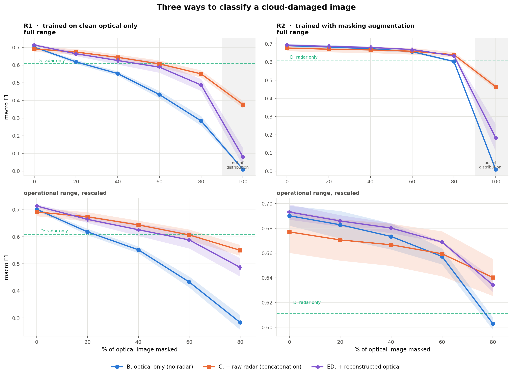
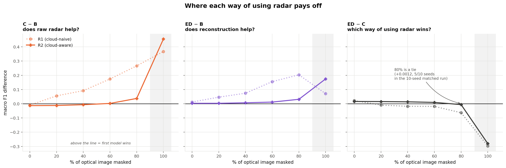
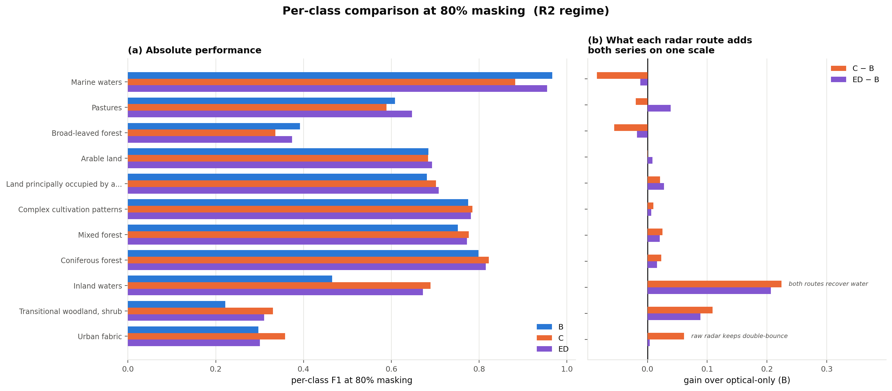
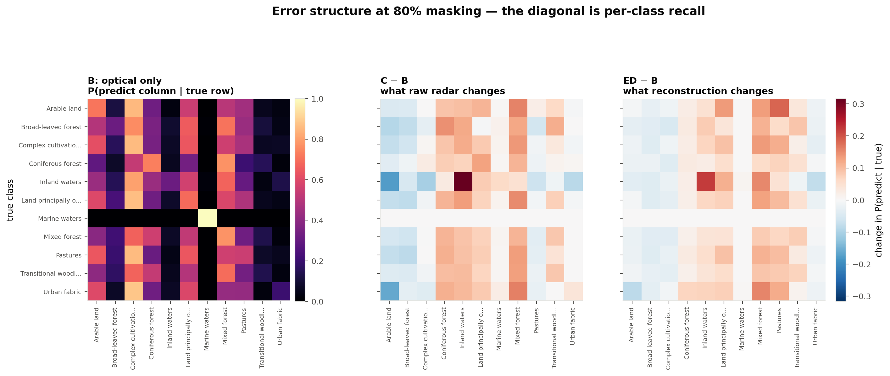
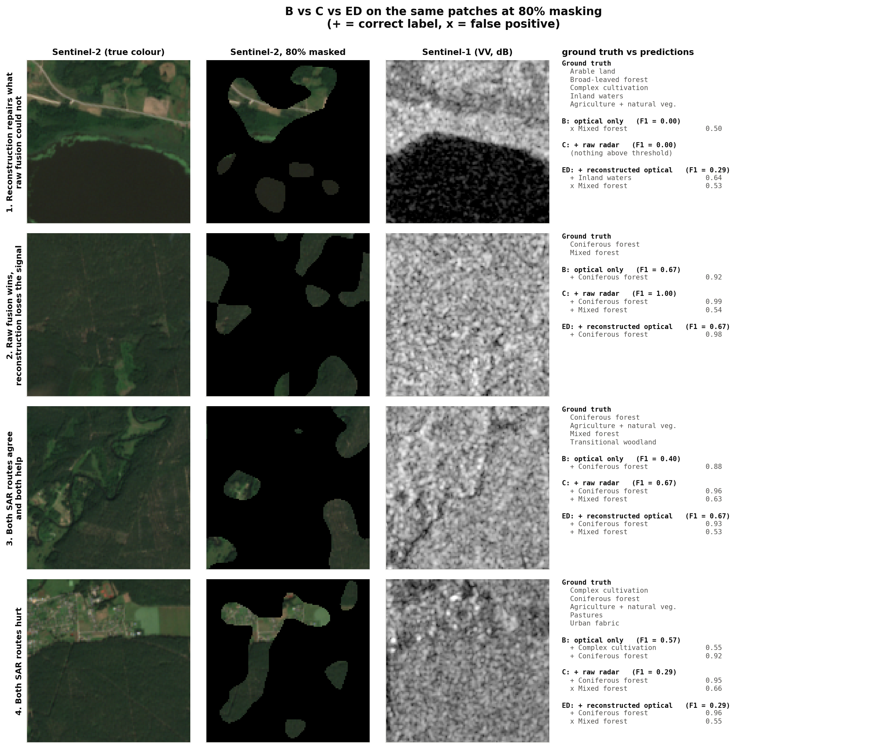

# SAR-Assisted Understanding

**Does Sentinel-1 radar carry information that recovers what cloud cover destroys
in Sentinel-2 — and if so, what is the right way to use it?**

Two answers, and the second only exists because the first was measured carefully.

**1. Most of the apparent benefit of radar is not radar.** Against an optical model
that has never seen a cloud, adding radar looks transformative: **+0.27** macro F1
at 80% cloud. Against an optical model trained with the *same* cloud augmentation,
the identical radar branch buys **+0.037**. Roughly **90% of the headline gain was
the benefit of training on degraded data at all.** A practitioner who ran only the
obvious version of this experiment would have credited radar with nine times its
real effect.

**2. How you use radar matters as much as whether you use it.** Three models, all
with the same frozen encoders and the same head:

| | what the classifier sees | best where |
|---|---|---|
| **B** | cloud-damaged optical only (384-d) | never — the baseline |
| **C** | optical **concatenated** with raw radar (2432-d) | above ~60% cloud |
| **ED** | optical + radar **reconstructed into optical feature space** (768-d) | below ~60% cloud |

Neither radar route dominates. At 80% cloud they tie in aggregate (+0.0012, 5/10
seeds) — but they disagree on **more than half of all individual patches**, in
almost perfectly balanced directions. The tie is two large opposing effects
cancelling, not two models behaving alike.



---

## 1. Problem statement

Optical satellite imagery is interpretable but frequently unusable: clouds obscure a
large fraction of Sentinel-2 acquisitions. Sentinel-1 SAR penetrates cloud and images
in all weather, but measures something physically different — surface roughness,
geometry and dielectric properties rather than reflectance.

The question is whether SAR is a useful *substitute signal* when optical observations
are partially unavailable. Concretely, we classify land cover under three conditions:

| | Condition | Input |
|---|---|---|
| **A** | Optical only | clean Sentinel-2 |
| **B** | Degraded optical | artificially masked Sentinel-2 |
| **C** | Degraded optical + SAR | the *same* masked Sentinel-2 + paired Sentinel-1 |

and compare **B vs C** across masking levels.

## 2. Hypothesis

> SAR provides complementary information that becomes increasingly useful as optical
> observations become unavailable.

This is treated as a hypothesis to be tested, not an assumption. As reported in
§13 it is **partially supported, and much more weakly than the naive comparison
suggests.**

The central methodological risk is that a careless design confirms it for the wrong
reason. If arm C is trained on degraded imagery while arm B is not, C wins — but
because of the training distribution, not because of SAR. The experiment is built
around eliminating that confound.

## 3. Dataset

**BigEarthNet v2.0 (reBEN), Lithuania / summer subset** — 8,775 paired Sentinel-1 /
Sentinel-2 patches, 2.48 GB.

| Property | Value |
|---|---|
| Source | [`hackelle/BigEarthNetV2-Lithuania-Summer-LMDB`](https://huggingface.co/datasets/hackelle/BigEarthNetV2-Lithuania-Summer-LMDB) |
| Provenance | LMDB conversion of the Zenodo originals via [rico-hdl](https://github.com/kai-tub/rico-hdl), the officially recommended tool, by a reBEN co-author (TU Berlin / RSiM) |
| Authoritative original | [Zenodo 10891137](https://zenodo.org/records/10891137) (118 GB) |
| Licence | CDLA-Permissive-1.0 |
| Patch size | 1.2 km × 1.2 km |
| Label type | **multi-label**, CLC-19 nomenclature |
| Tiles / acquisitions | 2 Sentinel-2 tiles (T35ULA, T34UDG), 2 dates (2017-07-20, 2017-08-08) |

### Why this subset

I did not choose a country subset for convenience alone — I measured the alternatives:

| Candidate | Size | Verdict |
|---|---|---|
| Zenodo official reBEN | 118 GB | measured **0.54 MB/s** from Zenodo → ~60 h. Infeasible |
| Full HF LMDB mirror | 155 GB | ~9.5 h at the measured 4.5 MB/s, and it is the entire dataset |
| `GFM-Bench`, `torchgeo`, `lc-col` mirrors | 13–200 GB | split archives; no partial extraction |
| `ranjeetgupta/...14K_S1_and_S2` | 3.1 GB | I listed its central directory over HTTP range requests without downloading it: 13,683 paired patches, but **Serbia-only, 4 tiles**, and an unverified repackaging |
| **Lithuania summer LMDB** | **2.48 GB** | official tooling, documented format, both modalities, official splits ✓ |

A single country is a real limitation (§15). It has one genuine benefit though: it
**removes the country confound**. In full reBEN, single-label "Pastures" patches are
99% Irish and "Agro-forestry" is 100% Portuguese, so a classifier there can score well
by recognising the region rather than the land cover. Within one country that shortcut
is unavailable.

### Single-label vs multi-label — verified, not assumed

BigEarthNet v2.0 is **multi-label**. I checked whether a clean single-label task could
be carved out of it, and it cannot: filtering to patches with exactly one label leaves
**1,476 of 8,775**, of which **89% are "Marine waters"** — degenerate.

So the task is multi-label classification over the **11 classes with ≥1000 positive
patches** (mean 3.5 labels/patch). Rarer classes are dropped; one patch left with no
label was removed, leaving **8,774**.

| Class | Positives | Prevalence |
|---|---:|---:|
| Complex cultivation patterns | 4,449 | 51% |
| Mixed forest | 4,174 | 48% |
| Coniferous forest | 3,862 | 44% |
| Arable land | 3,738 | 43% |
| Land principally occupied by agriculture… | 3,372 | 38% |
| Pastures | 2,981 | 34% |
| Transitional woodland, shrub | 2,588 | 30% |
| Broad-leaved forest | 1,923 | 22% |
| Marine waters | 1,432 | 16% |
| Urban fabric | 1,270 | 15% |
| Inland waters | 1,137 | 13% |

## 4. Data preprocessing and integrity checks

`scripts/01_build_subset.py` audits before modelling and prints everything it finds:

* **Pairing** — S1 and S2 keys come from the same metadata row. 8,774/8,774 unique
  `patch_id` and 8,774/8,774 unique `s1_name`; **0 problems** across a 400-pair deep audit.
* **Shapes/finiteness** — every pair verified as `(12,120,120)` and `(2,120,120)`, no NaN/Inf.
* **Cloud flags** — this metadata release already excludes patches flagged for seasonal
  snow, cloud or shadow. The base optical imagery is therefore clean, so **our artificial
  masking is the only degradation** — important, since real residual cloud would otherwise
  contaminate the "clean" reference.

## 5. Sentinel-2 preprocessing

12 L2A bands, stored at native resolution (120² / 60² / 20² for the 10/20/60 m bands).
Coarse bands are upsampled to 120² by **nearest neighbour** — deliberately, so no band
invents spatial detail it does not have. Then resized to 224² and scaled by `/10000`,
which is the SSL4EO pretraining recipe (`torchgeo._zhu_xlab_transforms`).

**Deviation, deliberate:** torchgeo's published recipe resizes to 256 and centre-crops
to 224, discarding the outer ~12% of the patch. Since this entire study is about *how
much of the patch is visible*, I resize 120→224 directly and keep the whole footprint.

## 6. Sentinel-1 preprocessing

VV/VH σ⁰ in dB, clipped to [−50, 10] dB to guard against layover/shadow spikes, then
standardised channel-wise with the SSL4EO-S12 statistics
`mean = [−12.59, −20.26]`, `std = [5.26, 5.91]`.

That those constants are appropriate is not assumed — the audit measured this subset
and found **VV −12.64 ± 4.22, VH −19.04 ± 5.46 dB**, closely matching the pretraining
statistics. SAR is **never masked**: it is the observation that survives the cloud.

## 7. Cloud / degradation simulation

`src/masking.py`. Levels **0 / 20 / 40 / 60 / 80 %**, plus **100%** as an extra bound.

| Property | Choice |
|---|---|
| Shape | spatially coherent blobs — thresholded low-pass-filtered Gaussian noise (σ = 8 px), *not* per-pixel dropout |
| Coverage | **exact**, by masking the top-`round(level·H·W)` pixels of the field by rank |
| Seed | `sha1(patch_id ‖ level ‖ 1234)` → deterministic per patch and level |
| Fill | per-band dataset mean = **0.0 after normalisation**, the neutral "no observation" encoding |
| Application | mask built at native 120², image resized bilinearly, mask resized **nearest** so cloud edges stay hard |

**Why coherent.** Per-pixel dropout at *p*% leaves nearly every local neighbourhood
partially visible, which is a much easier problem and would understate what SAR buys.
Measured: 91% of masked pixels are fully surrounded by other masked pixels under the
coherent scheme, vs 2.4% under pixel dropout.

**Why this makes B vs C fair.** Because the mask is a pure function of
`(patch_id, level, seed)`, arms B and C receive **byte-identical** degraded imagery.
This is asserted in the smoke test, not merely intended.

## 8. Optical encoder (ViT)

**`torchgeo/vit_small_patch16_224_sentinel2_all_moco`** — ViT-S/16, MoCo-v2
self-supervised on **SSL4EO-S12**. Used **frozen**, as a feature extractor → 384-d.

**A tempting model I deliberately rejected.** The `BIFOLD-BigEarthNetv2-0` organisation
publishes ViTs pretrained *on BigEarthNet v2.0 itself*. They would score substantially
better and be **scientifically invalid here**: our test patches are in their training
set. SSL4EO-S12 is label-free self-supervision on a different corpus, so there is no
label leakage.

**Handling 12 bands vs 13.** SSL4EO pretrained on 13 L1C bands; reBEN is L2A and has no
`B10` (cirrus), leaving 12. Because the pretraining normalisation is a plain `/10000`
with **no mean subtraction**, feeding `B10 = 0` contributes exactly zero to the patch
embedding — so deleting input-channel slice 10 from `patch_embed.proj.weight` is
*mathematically identical* to imputing B10 with its pretraining mean. Not an
approximation, not a random re-init, and not pretending multispectral data is RGB.

*Residual domain shift, documented:* SSL4EO is TOA (L1C), reBEN is BOA (L2A).

## 9. SAR encoder

**`torchgeo/resnet50_sentinel1_all_moco`** — ResNet-50, MoCo on SSL4EO-S12 VV/VH.
Used **frozen** → 2048-d.

**Why pretrained rather than a small CNN: symmetry.** Both branches are then frozen,
both MoCo-pretrained on the *same* corpus, and neither has seen a BigEarthNet label.
Any B→C difference is therefore attributable to the extra **modality**, not to the SAR
branch receiving trainable capacity the optical baseline never gets. A from-scratch SAR
CNN would confound exactly the two explanations the study exists to separate.
(`build_sar_encoder(scratch=True)` provides the small CNN as an alternative.)

## 10. Two ways to use radar

Both routes start from the same two frozen encoders and end in the same head
topology. They differ only in **what the head is fed**.

```
                                    ┌─────────────────────────────────────────┐
S2 ─mask─► ViT-S/16 [FROZEN] ─► 384 ─┤                                         │
                                    │  C  concat ─────────────► 2432 ─► head  │
S1 ───────► ResNet-50 [FROZEN] ─► 2048┤                                        │
                                    └─────────────────────────────────────────┘

                                    ┌─────────────────────────────────────────┐
S2 ─mask─► ViT-S/16 [FROZEN] ─► 384 ─┤                                         │
                                    │  ED concat ─────────────►  768 ─► head  │
S1 ───────► ResNet-50 [FROZEN] ─► 2048┴─► decoder ─► 384 ────────┘             │
                                    └─────────────────────────────────────────┘
```

* **Arm C — concatenation.** Bolt the raw 2048-d radar vector onto the 384-d
  optical vector and let the head sort it out. Tests whether radar is *useful*.
* **Arm ED — reconstruction.** First train a decoder to map radar onto the
  optical feature space (`z_sar → ẑ_clean`), then concatenate two 384-d vectors
  in *one* coordinate system. Tests whether radar can *predict* what the camera
  would have seen.
* **Arm B** is the identical head on the 384-d optical vector alone.
* **Arm D** is the identical head on the 2048-d radar vector alone.

The head is `LayerNorm → Linear(512) → ReLU → Dropout(0.3) → Linear(11)` in every
arm. `LayerNorm` matters in arm C especially: the ViT and ResNet features have
very different scales, and without it the larger-magnitude branch would dominate
the first layer by scale alone.

The ED decoder is `LayerNorm → Linear(2048,512) → ReLU → Dropout(0.3) →
Linear(512,384)`, trained on reconstruction loss alone and then **frozen** before
the head is trained. Full method in §17.

## 11. Training procedure

Only the head trains; both encoders stay frozen. This lets us run the encoders **once
per (split, modality, masking level)** and cache the vectors — which is what makes the
whole matrix (4 arms × 2 regimes × 6 levels × 3 seeds) cheap.

AdamW, lr 1e-3, weight decay 1e-4, batch 256, ≤40 epochs, early stopping (patience 8)
on **validation** macro F1. No hyperparameter tuning was performed — these are defaults.
Every arm uses the identical recipe, so arms differ only in their input.

### Two training regimes — and why both are needed

* **R1 "clean-trained"** — trained at 0% masking, evaluated degraded. This is the
  assignment's literal minimum baseline: *"evaluate the same model after masking"*.
* **R2 "degradation-aware"** — both arms trained with masking augmentation (a level
  drawn per sample per epoch from {0, 20, 40, 60, 80}%).

Reporting only R1 would confound "SAR helps" with "training on masked data helps".
Reporting only R2 would ignore what the assignment asked for. So both are reported —
and they disagree, which is the most interesting thing in this study.

### Controls

| Arm | What it isolates |
|---|---|
| **fusion_shuf** | SAR features **permuted across samples**: identical capacity, no genuine pairing. Separates "SAR carries information" from "the head has more parameters". |
| **sar** | SAR-only reference — how far SAR gets on its own. |

## 12. Evaluation methodology

Multi-label, so "accuracy" is stated carefully. Primary metric **macro F1** (as the
assignment names), at a **fixed 0.5 threshold that is never tuned**; **macro mAP** is
reported as the threshold-free companion; Hamming and exact-match accuracy also given.

**Splits.** The official reBEN splits are used, and verified rather than trusted. A
naive check looked alarming — 2 of 2 tiles appear in more than one split — so I plotted
the assignment on the patch grid:

```
TTTTTTTTTTTTTVVVVVVVVVVVVVVVVVVVVVVVVVVVVVVVVVVVVVVTTTTTTTTTTTTT
TTTTTTTTTTTTTVVVVVVVVVVEEEEEEEEEEEEEEEEEEEEEEEEEEEEVVVVVVVVVTTTT
TTTTTTTTTTTTTVVVVVVVVVVEEEEEEEEEEEEEEEEEEEEEEEEEEEEVVVVVVVVVTTTT
TTTTTTTTTTTTTVVVVVVVVVVVVVVVVVVVVVVVVVVVVVVVVVVVVVVVVVVVVVVVTTTT
```

The splits are **concentric contiguous spatial blocks** — test is an interior region
ringed by validation, ringed by train. Only **3.0% of adjacent patch pairs cross a split
boundary**, so spatial autocorrelation between train and test is confined to those
seams. Splits are frozen to `results/metrics/subset_manifest.csv` **before** any
masking, and masking is applied only at feature-extraction time.

All arms use the same splits, the same 2,151 test patches, and the same masks.

## 13. Results

Macro F1 on the test set. Full data: `results/metrics/unified_results.csv`.

### 13.1 All three models, both regimes

3 seeds, matching the original experiment exactly.

**R1 — trained on clean optical only** (the assignment's minimum baseline):

| Masking | B: optical only | C: + raw radar | ED: + reconstructed | D: radar only |
|---:|---:|---:|---:|---:|
| 0% | 0.7015 | 0.6916 | **0.7136** | 0.6087 |
| 20% | 0.6181 | **0.6738** | 0.6644 | 0.6087 |
| 40% | 0.5519 | **0.6438** | 0.6259 | 0.6087 |
| 60% | 0.4329 | **0.6068** | 0.5883 | 0.6087 |
| 80% | 0.2835 | **0.5501** | 0.4870 | 0.6087 |
| 100% | 0.0093 | **0.3768** | 0.0802 | 0.6087 |

**R2 — trained with masking augmentation** (the like-for-like comparison):

| Masking | B: optical only | C: + raw radar | ED: + reconstructed | D: radar only |
|---:|---:|---:|---:|---:|
| 0% | 0.6902 | 0.6771 | **0.6932** | 0.6110 |
| 20% | 0.6829 | 0.6706 | **0.6860** | 0.6110 |
| 40% | 0.6734 | 0.6667 | **0.6802** | 0.6110 |
| 60% | 0.6573 | 0.6595 | **0.6689** | 0.6110 |
| 80% | 0.6030 | **0.6403** | 0.6343 | 0.6110 |
| 100% | 0.0093 | **0.4642** | 0.1839 | 0.6110 |


**Read the two regimes against each other.** In R1, radar looks transformative —
arm C gains +0.27 at 80% masking. In R2, where *both* arms get the same masking
augmentation, the same radar branch buys **+0.037**. Roughly **90% of the
apparent benefit of radar was actually the benefit of training on degraded data
at all.** That confound is the single most important result in this repository,
and it is invisible unless you run both regimes.

**ED needs the degradation-aware regime.** Under R1 the reconstruction arm is
*worse* than plain concatenation nearly everywhere (0.4870 vs 0.5501 at 80%),
because a head trained only on clean features never learns to lean on the
reconstruction when the optical half degrades. The two ideas are not independent.

### 13.2 Which way of using radar is better? (10 seeds, paired)

A first 3-seed run put ED above C at 80% by +0.0074; an identical rerun gave
−0.0060. MPS kernels are non-deterministic and the gap is smaller than the
run-to-run spread, so this comparison was redone with **10 seeds, paired
arm-to-arm** — both arms trained in the same process with the same seed, so the
difference is taken *within* a seed (`scripts/09_ed_compare.py`).

| Masking | B | C | ED | ED − C | seeds ED>C | significant |
|---:|---:|---:|---:|---:|:---:|:---:|
| 0% | 0.6843 | 0.6681 | **0.6921** | +0.0240 | 10/10 | yes |
| 20% | 0.6738 | 0.6600 | **0.6829** | +0.0230 | 10/10 | yes |
| 40% | 0.6642 | 0.6569 | **0.6779** | +0.0210 | 10/10 | yes |
| 60% | 0.6447 | 0.6505 | **0.6673** | +0.0167 | 10/10 | yes |
| 80% | 0.5884 | 0.6341 | 0.6353 | +0.0012 | 5/10 | **no** |
| 100% | 0.0159 | **0.4894** | 0.1844 | −0.3051 | 0/10 | yes |

Three distinct regimes, and the honest summary needs all three:

1. **0–60% masking — reconstruction wins**, by +0.017 to +0.024, all 10 seeds agreeing.
2. **80% — a dead heat.** +0.0012 on 5/10 seeds. There is no claim to make here.
3. **100% — reconstruction fails badly**, −0.305, 0/10 seeds.



**Why ED wins at low masking.** Arm C hands the head 2432 numbers, 2048 of them
radar, and when the optical image is barely damaged those add nothing — at 0%
masking C is actually *worse* than plain optical (0.6771 vs 0.6902). The head has
to learn to ignore most of its input from 4205 training patches. ED instead
compresses radar to 384 dimensions **already aligned with the optical feature
space**, so the head sees a balanced input in one coordinate system.

**Why ED fails at 100%.** Every pixel is overwritten with the same fill, so
`z_degraded` is a constant and half the ED input is dead weight. Arm C survives
better because its 2048 raw radar dimensions dominate. This is a design flaw —
R2 trains on levels up to 0.8 and never on 1.0, so the head is out of
distribution — not a property of reconstruction. The 100% column is a bound, not
an operating point.

### 13.3 Per-class: the two radar routes keep different things



At 80% masking, ED − C per class:

| Class | support | ED − C | Reading |
|---|---:|---:|---|
| Marine waters | 116 | +0.073 | but see the tile confound in §15 |
| Pastures | 916 | +0.058 | spectrally distinctive |
| Broad-leaved forest | 511 | +0.038 | |
| Inland waters | 379 | −0.017 | specular return is radar-specific |
| Transitional woodland | 885 | −0.020 | structural, not spectral |
| Urban fabric | 265 | −0.057 | double-bounce is radar-specific |

The classes where **raw concatenation still beats reconstruction** are exactly
those with distinctive radar signatures that have **no optical analogue**:

* **Urban fabric** — buildings meeting the ground form a corner reflector, giving
  a bright *double-bounce* return. A geometry fact, not a colour fact.
* **Inland waters** — calm water is a mirror at radar wavelengths, so almost
  nothing returns and it reads near-black. Again geometry, not colour.

Forcing radar through a "predict the optical feature" bottleneck **necessarily
discards these**. That is the conceptual cost of the reconstruction framing, and
it shows up in the numbers rather than needing to be argued.



### 13.4 The aggregate tie at 80% hides large disagreement

ED and C differ by +0.0012 at 80%, which reads as "the same model". They are not:

| At 80% masking, 2151 test patches | count | share |
|---|---:|---:|
| ED strictly better than C (>0.05 per-patch F1) | 568 | 26.4% |
| C strictly better than ED (>0.05) | 553 | 25.7% |
| Tied within 0.05 | 1030 | 47.9% |

The two approaches disagree on **more than half of all patches**, in almost
perfectly balanced directions. The aggregate tie is two large opposing effects
cancelling, not agreement — and it is the strongest argument for **routing**
between them on estimated cloud fraction rather than picking a winner.



In the first row, a lakeside patch: the radar panel shows a large black region
(specular water). Arm B predicts one wrong label, arm C predicts *nothing* above
threshold, and ED recovers *Inland waters* at 0.64. The radar evidence was
equally available to arm C — routing it through the optical bottleneck is what
made it usable.

### 13.5 Answering the assignment's questions directly

**1. How much does optical degradation hurt?** Enormously if the model never saw
degradation (0.70 → 0.28 at 80%), and remarkably little if it did (0.69 → 0.60).
Masking augmentation alone recovers **+0.32 macro F1** at 80% — roughly **nine
times** the +0.037 that radar contributes there.

**2. Does radar recover the lost performance?** Partly, and how you use it
matters. Concatenation is neutral-to-negative up to 60% and helps at 80%
(+0.037, CI excludes zero). Reconstruction helps across 0–60% instead. Neither
recovers the clean-image ceiling.

**3. Where is radar most useful?** For concatenation, between 80% and 100% cloud.
For reconstruction, below 60%. Below ~60% the surviving optical pixels already
contain most of what raw radar would have told us.

**4. Does radar help all classes equally?** Emphatically not — see §13.3. Inland
waters gains +0.21 to +0.23 under both routes; Marine waters and Broad-leaved
forest are hurt at every operational level by concatenation.

**5. Are there situations where radar hurts?** Yes, and not marginally. In R2,
concatenation's gain is **negative and outside the bootstrap CI at 0–40%
masking**. At the patch level at 80% masking, concatenation **repairs 1.7%** of
test patches and **breaks 3.0%** — it damages nearly twice as many as it fixes,
while still improving macro F1, because the repairs are concentrated in rare
classes that macro-averaging weights heavily. That divergence between
patch-level and class-level accounting is worth stating plainly.

### 13.6 The threshold-free view

Macro F1 at 100% masking (0.0093) is a **threshold artefact**, not total
ignorance: with a constant input the model emits one class for every patch, which
for most classes sits below 0.5, so it predicts nothing. mAP shows what is
actually retained — full numbers in `results/metrics/unified_results.csv`.

## 14. Failure analysis


Examples are selected by a **rule fixed in advance** on per-sample F1, with the two
failure categories included by construction — nothing is cherry-picked. Frequencies
over all 2,151 test patches at 80% masking:

| Case | Frequency |
|---|---:|
| 1. Optical already succeeds, SAR adds little | 16.8% |
| 2. Optical fails, SAR repairs it | 1.7% |
| 3. Both fail | 2.5% |
| 4. SAR actively hurts | 3.0% |

**What the examples suggest.**

* *Case 1* is open water: uniform, unambiguous, and correctly called at 1.00 confidence
  through 80% masking. SAR has nothing to add because nothing was lost.
* *Case 2* is a heterogeneous agricultural mosaic. With 80% masked, optical sees only
  forest fragments and predicts forest; adding SAR restores Arable land and Complex
  cultivation — field geometry and roughness are visible to SAR regardless of cloud.
* *Case 3* is a mixed forest/pasture patch where both arms collapse onto the two
  dominant forest classes. SAR does not help because conifer, broad-leaf and pasture are
  not separable by backscatter alone.
* *Case 4* is the instructive failure: a pure **Coniferous forest** patch that optical
  gets exactly right, where SAR adds a spurious **Mixed forest** label at 0.60
  confidence. Volume scattering from a conifer canopy and a mixed canopy look alike, so
  SAR pulls the prediction toward the more common class. This is the mechanism behind
  the negative per-class gains for Broad-leaved forest and Pastures.

**On confidence.** Predictions in the error matrices show SAR broadly *raising*
prediction rates (the C−B panel is mostly red), i.e. the fusion model is less
conservative. That helps recall on rare classes and costs precision on spectral ones.


The single clearest signal is the **Inland waters diagonal cell, +0.31** — SAR raises
correct Inland-waters recall by 31 points at 80% masking.

## 15. Limitations

Stated plainly, because several of them bound how far these numbers travel.

1. **Two Sentinel-2 tiles, two dates, one country, one season.** This is the big one.
   8,774 patches sounds substantial but they come from **2 acquisitions**. Effective
   sample size for generalisation is far smaller than the patch count suggests, and
   nothing here speaks to winter, other biomes, or other SAR geometries.
2. **Frozen encoders.** No fine-tuning. A fine-tuned SAR encoder would likely extract
   more; the frozen setting was chosen for symmetry and budget, so absolute numbers are
   not competitive with the reBEN leaderboard and are not meant to be.
3. **Seed variance rivals the effect.** In R2 the across-seed std of the gain (±0.02)
   is comparable to the gain itself below 80%. The bootstrap CIs are narrow because they
   resample test patches for a *fixed* seed; the honest reading is that **sub-0.02 gains
   in R2 are not resolvable with 3 seeds**.
4. **Simulated clouds are not clouds.** Real cloud brings semi-transparent edges, thin
   cirrus, shadow offset from the cloud, and correlation with weather and hence with
   land cover and SAR conditions. Our masks are opaque, land-cover-independent and
   crisply bounded — an easier and cleaner problem.
5. **SAR and S2 are not same-day.** reBEN pairs each S2 patch with a nearby S1
   acquisition; temporal offset adds noise a same-day pairing would not have.
6. **A 3% split seam.** Adjacent patches across block boundaries are spatially
   correlated. Small, but not zero.
7. **11 classes, not 19.** Six rare classes were dropped, which removes exactly the
   long tail where macro F1 is hardest.
8. **The 100% column is a bound, not an operating point.** It is out-of-distribution for
   R2 training (max 80%), which is why fusion at 100% (0.464) sits *below* SAR-only
   (0.611).

## 16. What I would try next

In rough order of expected value per unit effort:

1. **Route between C and ED on estimated cloud fraction.** The two arms disagree on
   52% of patches in balanced directions (§13.4), and the crossover is already
   measured at ~60% masking. A selector using reconstruction below it and
   concatenation above should beat both. This is the clearest win available and it
   needs no new training.
2. **More tiles before any modelling change.** Every improvement is currently
   dominated by having 2 acquisitions. Adding the Serbia subset (verified as 13,683
   paired patches, 4 tiles) would double geographic coverage for ~3 GB.
3. **Condition the decoder on cloud fraction.** `ẑ_clean` is currently
   level-invariant. Feeding the estimated masking level, or `z_degraded` itself, as
   an extra decoder input directly fixes the residual variant's failure mode (§17.5).
4. **Realistic cloud masks** — real Sentinel-2 cloud masks (e.g. s2cloudless) rather
   than synthetic blobs, including semi-transparency and displaced shadow.
5. **Add 1.0 to `train_levels`.** Removes the 100% artefact for both C and ED. One
   line, about a minute of compute.
6. **Give the model the mask.** Both arms must currently infer which pixels are
   missing. A mask channel is a more honest formulation of "missing observation" and
   should raise arm B in particular — which would *shrink* the measured radar gain,
   which is a reason to run it.
7. **More seeds.** 3 is too few given the effect sizes; the 10-seed matched run in
   §13.2 exists precisely because 3 gave a sign flip.
8. **Fine-tune the radar branch.** The frozen/symmetric design answers the causal
   question; unfreezing measures the achievable ceiling. Do it last — it reintroduces
   the capacity confound the frozen design exists to exclude.

---

## 17. Method and controls for the reconstruction arm (ED)

> Arms A–D and every number in the original two-arm study are unchanged and were
> not re-run. ED was added alongside them and is compared *against* them.

### 17.1 What it asks, and why it is a different question

Arm C asks whether radar is **useful alongside** cloud-damaged optical. ED asks
something strictly stronger:

> Can Sentinel-1 predict the ViT feature that a *cloud-free* Sentinel-2 image
> would have produced?

The two can come apart in both directions. Radar could help a classifier while
being a poor predictor of optical features (it contributes in its own coordinate
system), or predict them well while adding nothing usable. So it is measured on
its own terms rather than inferred from the arm C result.

**This reconstructs the 384-d feature vector, never the Sentinel-2 pixels.**

### 17.2 Training: two deliberately separate stages

1. **Decoder.** `z_sar (2048) → ẑ_clean (384)`, trained on MSE against the clean
   ViT feature. It **never sees a class label**. Model selection on validation
   reconstruction loss. AdamW, lr 1e-3, wd 1e-4, batch 256, ≤60 epochs, patience 10.
2. **Classifier.** The decoder is frozen, then the head is trained on
   `[z_degraded ; ẑ_clean]` with exactly the recipe arms B and C use.

Joint end-to-end training would score better and was rejected on purpose: a
jointly-trained decoder is a reparameterised fusion head, and the reconstruction
metric would stop being independent evidence. **ED is therefore not the strongest
possible version of this idea — it is the version that can be measured.**

The `ed` decoder is regime-independent by construction: neither its input (radar,
never masked) nor its target (the clean feature) depends on the masking level.

The input `LayerNorm` on the decoder is a deliberate addition: SSL4EO radar
features have mean L2 norm **43.73 on train but 23.95 on test**, and an
unnormalised first layer would bake in a scale the test split does not share. Set
`encoder_decoder.input_norm: false` for the strictly minimal MLP.

### 17.3 The measurement trap, and the control that catches it

Raw cosine between `ẑ_clean` and `z_clean` is **0.987**, which looks like a solved
problem. It is not. This feature space is strongly anisotropic — **93.1% of the
feature energy lies in the dataset mean vector**:

| Predictor | cos vs `z_clean` | what it knows |
|---|---:|---|
| Two **unrelated** patches | 0.9575 | nothing — different places |
| Constant training-set mean | 0.9758 | nothing patch-specific |
| **The decoder** | **0.9871** | the radar image |

The entire achievement sits in the gap from 0.976 to 0.987. So the reported
metrics are **mean-relative**: `R² = 1 − MSE/MSE_mean` (variance explained beyond
the constant predictor) and centred cosine. The mean is computed on **train**
only — using the test mean would leak test statistics into the baseline.

The decisive test is the control the main study already uses for arm C: break the
correspondence and see what survives. `ed_shuf` is identical to `ed` except the
radar rows are permuted against their targets during decoder training.

| | R² | centred cos | raw cos |
|---|---:|---:|---:|
| Decoder on real radar | **+0.4569** | **0.6403** | 0.9871 |
| Decoder on shuffled radar | −0.0054 | 0.0540 | 0.9759 |
| *(constant mean predictor)* | 0.0000 | 0.0000 | 0.9758 |

The control collapses **exactly** onto the mean predictor. So the real decoder's
R² = 0.457 is genuine, patch-specific learning: radar predicts about **46% of the
patch-to-patch variance** in the clean optical feature. And note what raw cosine
did — it moved 0.011 between a model that learned nothing and one that learned a
real mapping. It could not have told them apart.

### 17.4 Does the reconstruction beat the damaged feature?

`ẑ_clean` is level-invariant (radar is never masked), so its R² is flat while the
damaged optical feature's decays:

| Masking | R² of `z_degraded` | R² of `ẑ_clean` | closer to clean? |
|---:|---:|---:|:---:|
| 0% | +1.000 | +0.457 | no — `z_degraded` *is* `z_clean` |
| 20% | +0.261 | +0.457 | **yes** |
| 40% | −0.530 | +0.457 | **yes** |
| 60% | −1.486 | +0.457 | **yes** |
| 80% | −2.732 | +0.457 | **yes** |
| 100% | −6.584 | +0.457 | **yes** |

**Crossover at ≈15% masking.** Above roughly 15% cloud, a radar image predicts
the clean optical representation *better than the cloudy optical image itself
does*. Note also that `z_degraded`'s R² goes sharply negative: past ~40% masking
the ViT's own output is further from the clean feature than guessing the dataset
average.


This is a statement about **feature-space distance**, not classification accuracy
— §13.2 shows classification does not simply follow, which is why both are measured.

### 17.5 The residual variant

`ed_residual` predicts Δ = `z_clean − z_degraded` and reconstructs
`ẑ = z_degraded + Δ̂`. It is R2-only (under R1 the residual target is identically
zero). It is limited by construction: the decoder sees only radar, which does not
change with the masking level, but Δ does — so under MSE its best strategy is to
predict the *average* residual and it cannot condition on actual cloudiness.

| Masking | R² direct | R² residual |
|---:|---:|---:|
| 20% | +0.457 | **+0.605** |
| 40% | +0.457 | +0.521 |
| 60% | +0.457 | +0.167 |
| 80% | +0.457 | −0.593 |

Classification tracks this exactly: marginally better than direct at 0–40%,
clearly worse at 80% (0.6123 vs 0.6343), degenerate at 100%. Reported for
completeness; **the direct variant is the better formulation.**

### 17.6 Leakage checks

`scripts/11_ed_leakage_audit.py` verifies on trained models, not toy tensors:

| Perturbation | Change in ED test predictions |
|---|---|
| Overwrite `z_clean` (the target) with noise | **max │Δ│ = 0.00e+00** |
| Overwrite `z_degraded` (the real input) with noise | mean │Δ│ = 0.174 |

Predictions are **bit-identical** when the clean feature is destroyed — and the
second row matters just as much, because it shows the first test is not passing
vacuously. Also verified: decoder output is identical whether clean or
100%-masked optical is passed alongside; the decoder raises `ValueError` on any
384-d input; it maps 2048 → 384 so neither dimension is the 11-class label space;
and train/validation/test patch ids are pairwise disjoint.

### 17.7 Limitations specific to ED

* **Frozen encoders.** R² = 0.457 is a statement about *this* frozen ResNet-50,
  not about radar in general.
* **Two-stage, not joint** — deliberate (§17.2), but it means ED is not the best
  achievable version.
* **The reconstruction is level-invariant.** `ẑ_clean` does not know how much of
  the image is missing; the residual variant's failure is direct evidence that
  conditioning on cloud fraction would help.
* **R² = 0.457 is mid-range.** Radar explains under half the patch-to-patch
  variance, and §13.3 shows the reconstruction is systematically biased toward
  what is spectrally rather than structurally distinctive.
* **All of §15 still applies** — 2 tiles, 2 dates, synthetic masks, and the
  Marine-waters/tile confound, which is the largest ED−C per-class gain and
  should be treated as the least trustworthy number here.

### 17.8 Running it

```bash
python scripts/smoke_test_ed.py            # shapes, gradients, leakage guards
python scripts/08_encoder_decoder.py       # both regimes, variants, controls  (53 s)
python scripts/09_ed_compare.py --seeds 10 # matched B vs C vs ED             (203 s)
python scripts/12_unified_analysis.py      # merged tables, every arm
python scripts/13_unified_figures.py       # three-model figures 07-10
python scripts/14_qualitative_unified.py   # three-model figure 11
python scripts/11_ed_leakage_audit.py      # leakage audit on trained models
```

A longer first-principles walkthrough — feature spaces, the anisotropy trap, the
controls, and the per-class trade — is in `encoder_decoder_explained.pdf`
(31 pages), a companion to `project_explanation.pdf`.

---

## Reproducing

```bash
pip install -r requirements.txt
export DATA_DIR=./data/raw          # optional; this is the default
bash scripts/run_experiment.sh      # ~55 min end to end on an M4 Pro (MPS)
```

Or step by step:

```bash
python3 scripts/00_download.py        # 2.7 GB: dataset + both encoders
python3 scripts/01_build_subset.py    # class/patch selection + data audit
python3 scripts/smoke_test.py         # end-to-end check on 16 patches
python3 scripts/02_extract_features.py# frozen-encoder cache (~12 min)
python3 scripts/03_run_experiments.py # all arms x regimes x seeds (~1 min)
python3 scripts/04_analyse.py         # gain tables + bootstrap CIs
python3 scripts/05_make_figures.py
python3 scripts/06_qualitative.py
python3 scripts/07_ablation_fill.py   # optional: bright-cloud fill ablation
```

Every parameter that affects a result lives in `configs/config.yaml`. Seeds are fixed
(global 42; training seeds 0/1/2; mask seed 1234). There are no absolute paths.

### Layout

```
├── configs/config.yaml            # all experiment parameters
├── src/
│   ├── config.py  dataset.py  masking.py  preprocessing.py
│   ├── features.py                # frozen-encoder extraction + cache
│   ├── models/{vit_encoder,sar_encoder,fusion_model}.py
│   ├── train.py  evaluate.py  visualization.py
├── scripts/00..07 + smoke_test.py + run_experiment.sh
├── notebooks/analysis.ipynb       # walkthrough of the results
└── results/{metrics,figures,checkpoints}
```

### Outputs

| File | Contents |
|---|---|
| `results/metrics/results.csv` | 144 rows: regime × arm × seed × level × metrics |
| `results/metrics/sar_gain_table.csv` | headline B-vs-C table with bootstrap CIs |
| `results/metrics/per_class_sar_gain.csv` | per-class F1 delta at every level |
| `results/metrics/per_class.csv` | per-class P/R/F1/AP and TP/FP/FN/TN |
| `results/metrics/error_matrices.npz` | P(predict j \| true i) per arm and level |
| `results/metrics/test_probs.npz` | test probabilities, for the failure analysis |
| `results/metrics/subset_manifest.csv` | the frozen split assignment |
| `results/metrics/ablation_bright_fill_summary.csv` | fill-strategy ablation |
| `results/figures/*.png` | figures 01–05 |

---

## External assets used

Documented as the assignment requires.

| Asset | Source | Licence | Role |
|---|---|---|---|
| BigEarthNet v2.0 (reBEN), Lithuania-summer LMDB | [HF `hackelle/...`](https://huggingface.co/datasets/hackelle/BigEarthNetV2-Lithuania-Summer-LMDB), originals on [Zenodo](https://zenodo.org/records/10891137) | CDLA-Permissive-1.0 | dataset |
| ViT-S/16 SSL4EO-S12 MoCo (Sentinel-2) | [HF `torchgeo/vit_small_patch16_224_sentinel2_all_moco`](https://huggingface.co/torchgeo/vit_small_patch16_224_sentinel2_all_moco) | CC-BY-4.0 | optical encoder (frozen) |
| ResNet-50 SSL4EO-S12 MoCo (Sentinel-1) | [HF `torchgeo/resnet50_sentinel1_all_moco`](https://huggingface.co/torchgeo/resnet50_sentinel1_all_moco) | CC-BY-4.0 | SAR encoder (frozen) |
| Preprocessing constants | [torchgeo](https://github.com/microsoft/torchgeo) `models/resnet.py`, `models/vit.py` | MIT | normalisation recipes |
| timm, PyTorch, scikit-learn, pandas, matplotlib, lmdb, safetensors | see `requirements.txt` | various OSS | libraries |

No code was copied from external sources; the torchgeo transform constants were read
from its source and are cited inline in `src/preprocessing.py`. torchgeo itself is not a
dependency (it requires Python ≥3.10) — the weights are loaded directly into `timm`.

**Key references**

* Clasen et al., *reBEN: Refined BigEarthNet Dataset for Remote Sensing Image Analysis*, IGARSS 2025 ([arXiv:2407.03653](https://arxiv.org/abs/2407.03653))
* Wang et al., *SSL4EO-S12: A Large-Scale Multi-Modal, Multi-Temporal Dataset for Self-Supervised Learning in Earth Observation* ([arXiv:2211.07044](https://arxiv.org/abs/2211.07044))
